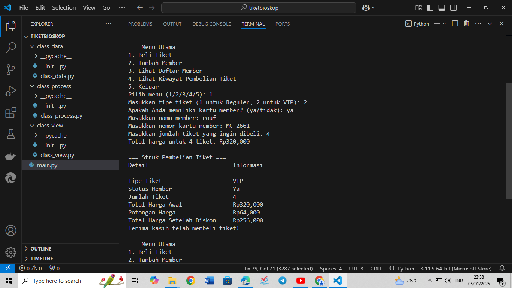

# Tugas-UAS-Project-Pemrogaman
# DATA DIRI
### Nama : RO'UF MUHAMMAD FAUZAN
### Kelas : TI.24.A1
### NIM : 312410157

## Program akan meminta masukan input yang terdiri dari beli tiket, tambah member, lihat daftar member dan riwayat pembelian tiket.

## Class Data
## _init.py
```Python
# class_data/__init__.py
from .class_data import Data
```
## class_data.py
```Python
import random

class Data:
    def __init__(self):
        self.database_member = {}
        self.riwayat_pembelian = []

    def generate_card_number(self):
        """Menghasilkan nomor kartu member secara acak."""
        return f"MC-{random.randint(1000, 9999)}"

    def tambah_member(self, nama):
        """Menambahkan nama member ke dalam database."""
        if nama not in self.database_member:
            nomor_kartu = self.generate_card_number()
            self.database_member[nama] = nomor_kartu
            return f"{nama} telah ditambahkan sebagai member dengan nomor kartu {nomor_kartu}."
        else:
            return f"{nama} sudah terdaftar sebagai member."

    def daftar_member(self):
        """Menampilkan daftar member yang terdaftar."""
        if self.database_member:
            return self.database_member
        else:
            return "Belum ada member yang terdaftar."

    def simpan_riwayat(self, pembelian):
        """Menyimpan riwayat pembelian."""
        self.riwayat_pembelian.append(pembelian)

    def lihat_riwayat(self):
        """Menampilkan riwayat pembelian tiket."""
        return self.riwayat_pembelian
```
## Class Process
## _init.py
```Python
# class_process/__init__.py
from .class_process import Process
```
## class_process.py
```Python
class Process:
    def __init__(self, data):
        self.data = data

    def hitung_harga_tiket(self, tipe_tiket, status_member):
        """Menghitung harga tiket bioskop berdasarkan tipe dan status member."""
        harga_dasar = 50000 if tipe_tiket == "1" else 100000
        diskon = 0.2 if status_member == "ya" else 0
        total_harga = harga_dasar - (harga_dasar * diskon)
        return total_harga, harga_dasar, diskon

    def beli_tiket(self, tipe_tiket, status_member, jumlah_tiket):
        """Mengelola pembelian tiket."""
        total_harga = 0
        for _ in range(jumlah_tiket):
            harga, harga_dasar, diskon = self.hitung_harga_tiket(tipe_tiket, status_member)
            total_harga += harga
        return total_harga
```
## Class View
##  _init.py
```Python
# class view/__init__.py
from .class_view import View
```
## class_view.py
```Python
class View:
    @staticmethod
    def display_message(message):
        print(message)

    @staticmethod
    def display_member_list(members):
        print("\n=== Daftar Member ===")
        print(f"{'Nama Member':<20} {'Nomor Kartu':<15}")
        print("=" * 35)
        
        for member, nomor_kartu in members.items():
            print(f"{member:<20} {nomor_kartu:<15}")

    @staticmethod
    def display_purchase_history(history):
        print("\n=== Riwayat Pembelian Tiket ===")
        print(f"{'No':<5} {'Tipe Tiket':<20} {'Status Member':<15} {'Jumlah Tiket':<15} {'Total Harga':<15}")
        print("=" * 80)
        
        for index, pembelian in enumerate(history, start=1):
            print(f"{index:<5} {pembelian['tipe_tiket']:<20} {'Ya' if pembelian['status_member'] == 'ya' else 'Tidak':<15} {pembelian['jumlah_tiket']:<15} Rp{pembelian['total_harga']:,.0f}")

    @staticmethod
    def display_ticket_receipt(pembelian):
        print("\n=== Struk Pembelian Tiket ===")
        print(f"{'Detail':<30} {'Informasi':<15}")
        print("=" * 50)
        
        print(f"{'Tipe Tiket':<30} {pembelian['tipe_tiket']:<15}")
        print(f"{'Status Member':<30} {'Ya' if pembelian['status_member'] == 'ya' else 'Tidak':<15}")
        print(f"{'Jumlah Tiket':<30} {pembelian['jumlah_tiket']:<15}")
        
        # Hitung total harga awal
        total_harga_awal = pembelian['total_harga']
        print(f"{'Total Harga Awal':<30} Rp{total_harga_awal:,.0f}")

        # Hitung potongan harga jika member
        if pembelian['status_member'] == 'ya':
            potongan_harga = total_harga_awal * 0.2  # Potongan 20%
            total_harga_setelah_diskon = total_harga_awal - potongan_harga
            print(f"{'Potongan Harga':<30} Rp{potongan_harga:,.0f}")
            print(f"{'Total Harga Setelah Diskon':<30} Rp{total_harga_setelah_diskon:,.0f}")
        else:
            print(f"{'Total Harga':<30} Rp{total_harga_awal:,.0f}")

        print("Terima kasih telah membeli tiket!")
```
## main.py
```Python
from class_data import Data
from class_view import View
from class_process import Process

def main():
    data = Data()
    process = Process(data)

    while True:
        print("\n=== Menu Utama ===")
        print("1. Beli Tiket")
        print("2. Tambah Member")
        print("3. Lihat Daftar Member")
        print("4. Lihat Riwayat Pembelian Tiket")
        print("5. Keluar")

        pilihan = input("Pilih menu (1/2/3/4/5): ")
        if pilihan == "1":
            # Logika untuk membeli tiket
            tipe_tiket = input("Masukkan tipe tiket (1 untuk Reguler, 2 untuk VIP): ")
            status_member = input("Apakah Anda memiliki kartu member? (ya/tidak): ").lower()
            
            if status_member == 'ya':
                nama_member = input("Masukkan nama member: ")
                nomor_kartu = input("Masukkan nomor kartu member: ")
                
                # Verifikasi member
                members = data.daftar_member()  # Ambil daftar member
                if (nama_member not in members) or (nomor_kartu != members[nama_member]):
                    View.display_message("Nama atau nomor kartu member tidak terdaftar. Anda tidak dapat menggunakan status member.")
                    status_member = 'tidak'  # Set status_member ke 'tidak' jika tidak terdaftar

            # Validasi jumlah tiket
            while True:
                try:
                    jumlah_tiket = int(input("Masukkan jumlah tiket yang ingin dibeli: "))
                    if jumlah_tiket > 0:
                        break
                    else:
                        print("Jumlah tiket harus lebih dari 0.")
                except ValueError:
                    print("Input tidak valid! Silakan masukkan angka.")

            # Hitung total harga
            total_harga = process.beli_tiket(tipe_tiket, status_member, jumlah_tiket)
            
            # Simpan riwayat pembelian
            pembelian = {
                'tipe_tiket': 'Reguler' if tipe_tiket == "1" else 'VIP',
                'status_member': status_member,
                'jumlah_tiket': jumlah_tiket,
                'total_harga': total_harga
            }
            data.simpan_riwayat(pembelian)
            
            # Tampilkan total harga
            View.display_message(f"Total harga untuk {jumlah_tiket} tiket: Rp{total_harga:,.0f}")
            
            # Tampilkan struk pembelian
            View.display_ticket_receipt(pembelian)
            
        elif pilihan == "2":
            nama = input("Masukkan nama member: ")
            message = data.tambah_member(nama)
            View.display_message(message)
        elif pilihan == "3":
            members = data.daftar_member()
            View.display_member_list(members)
        elif pilihan == "4":
            history = data.lihat_riwayat()
            View.display_purchase_history(history)
        elif pilihan == "5":
            View.display_message("Terima kasih! Sampai jumpa.")
            break
        else:
            View.display_message("Pilihan tidak valid! Silakan pilih menu yang tersedia.")

if __name__ == "__main__":
    main()  # Pastikan untuk memanggil fungsi main dengan tanda kurung
```
# Penjelasan Code
class data:
1. Import Library
import random: Mengimpor modul random untuk menghasilkan angka acak.
2. Definisi Kelas
class Data:: Mendefinisikan kelas Data yang akan mengelola informasi anggota dan riwayat pembelian.
3. Inisialisasi Kelas
def __init__(self):: Metode konstruktor yang dipanggil saat objek dari kelas Data dibuat.
self.database_member = {}: Inisialisasi dictionary untuk menyimpan nama anggota dan nomor kartu mereka.
self.riwayat_pembelian = []: Inisialisasi list untuk menyimpan riwayat pembelian anggota.
4. Metode generate_card_number
def generate_card_number(self):: Metode untuk menghasilkan nomor kartu member.
return f"MC-{random.randint(1000, 9999)}": Menghasilkan nomor kartu dengan format "MC-XXXX", di mana XXXX adalah angka acak antara 1000 dan 9999.
5. Metode tambah_member
def tambah_member(self, nama):: Metode untuk menambahkan anggota baru.
if nama not in self.database_member:: Memeriksa apakah nama anggota sudah terdaftar.
nomor_kartu = self.generate_card_number(): Menghasilkan nomor kartu baru jika nama belum terdaftar.
self.database_member[nama] = nomor_kartu: Menambahkan nama dan nomor kartu ke dalam database.
return f"{nama} telah ditambahkan sebagai member dengan nomor kartu {nomor_kartu}.": Mengembalikan pesan sukses.
else:: Jika nama sudah terdaftar.
return f"{nama} sudah terdaftar sebagai member.": Mengembalikan pesan bahwa anggota sudah ada.
6. Metode daftar_member
def daftar_member(self):: Metode untuk menampilkan daftar anggota.
if self.database_member:: Memeriksa apakah ada anggota yang terdaftar.
return self.database_member: Mengembalikan dictionary anggota.
else:: Jika tidak ada anggota.
return "Belum ada member yang terdaftar.": Mengembalikan pesan bahwa belum ada anggota.
7. Metode simpan_riwayat
def simpan_riwayat(self, pembelian):: Metode untuk menyimpan riwayat pembelian.
self.riwayat_pembelian.append(pembelian): Menambahkan pembelian ke dalam list riwayat pembelian.
8. Metode lihat_riwayat
def lihat_riwayat(self):: Metode untuk menampilkan riwayat pembelian.
return self.riwayat_pembelian: Mengembalikan list riwayat pembelian.

class prosess:
1. Metode __init__
Fungsi: Konstruktor yang dipanggil saat objek dari kelas Process dibuat.
Parameter:
data: Parameter ini disimpan dalam atribut self.data, tetapi tidak digunakan dalam metode lain.
2. Metode hitung_harga_tiket
Fungsi: Menghitung harga tiket bioskop berdasarkan tipe tiket dan status keanggotaan.
Parameter:
tipe_tiket: Menentukan jenis tiket (1 atau lainnya).
status_member: Menentukan apakah pembeli adalah member ("ya" atau tidak).
Proses:
Menentukan harga_dasar:
50.000 jika tipe_tiket adalah "1".
100.000 jika tipe_tiket bukan "1".
Menentukan diskon:
20% (0.2) jika status_member adalah "ya".
0% jika tidak.
Menghitung total_harga dengan rumus:
total_harga = harga_dasar - (harga_dasar * diskon).
Output: Mengembalikan tiga nilai:
total_harga: Harga setelah diskon.
harga_dasar: Harga dasar tiket.
diskon: Besaran diskon yang diterapkan.
3. Metode beli_tiket
Fungsi: Mengelola pembelian tiket dalam jumlah tertentu.
Parameter:
tipe_tiket: Jenis tiket yang ingin dibeli.
status_member: Status keanggotaan pembeli.
jumlah_tiket: Jumlah tiket yang ingin dibeli.
Proses:
Menginisialisasi total_harga menjadi 0.
Melakukan iterasi sebanyak jumlah_tiket:
Memanggil hitung_harga_tiket untuk mendapatkan harga tiket.
Menambahkan harga tiket ke total_harga.
Output: Mengembalikan total_harga, yaitu total biaya yang harus dibayar untuk tiket yang dibeli.

class view:
1. Metode display_message
Fungsi: Menampilkan pesan yang diberikan.
Parameter:
message: Pesan yang ingin ditampilkan.
Output: Mencetak pesan ke konsol.
2. Metode display_member_list
Fungsi: Menampilkan daftar member dan nomor kartu mereka.
Parameter:
members: Dictionary yang berisi nama member sebagai kunci dan nomor kartu sebagai nilai.
Output:
Mencetak header "Daftar Member".
Mencetak tabel dengan dua kolom: "Nama Member" dan "Nomor Kartu".
Menampilkan setiap member dan nomor kartunya dalam format yang rapi.
3. Metode display_purchase_history
Fungsi: Menampilkan riwayat pembelian tiket.
Parameter:
history: List yang berisi informasi pembelian tiket, di mana setiap item adalah dictionary dengan detail pembelian.
Output:
Mencetak header "Riwayat Pembelian Tiket".
Mencetak tabel dengan kolom: "No", "Tipe Tiket", "Status Member", "Jumlah Tiket", dan "Total Harga".
Menampilkan setiap pembelian dengan format yang rapi, termasuk konversi total harga ke format mata uang.
4. Metode display_ticket_receipt
Fungsi: Menampilkan struk pembelian tiket.
Parameter:
pembelian: Dictionary yang berisi detail pembelian tiket, termasuk tipe tiket, status member, jumlah tiket, dan total harga.
Output:
Mencetak header "Struk Pembelian Tiket".
Menampilkan detail pembelian dalam format yang rapi:
Tipe tiket
Status member (Ya/Tidak)
Jumlah tiket
Total harga awal
Jika pembeli adalah member, menghitung dan menampilkan:
Potongan harga (20%)
Total harga setelah diskon
Jika bukan member, hanya menampilkan total harga awal.
Mencetak pesan terima kasih setelah struk selesai.
